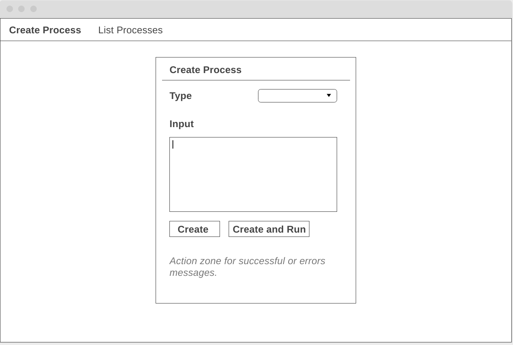

# Prueba técnica perfil Full-Stack developer

Importante: te recomendamos que leas antes las [consideraciones generales](../../../-/tree/main) comunes a todas las
pruebas de este repositorio.

## Introducción
El objetivo de esta prueba es demostrar tus capacidades para desarrollar una aplicación web de gestión de procesos compuesta de:
Frontend tipo Single Page Application, Backend PHP API HTTP REST, persistencia en base de datos y procesado de datos en Node.

## ¿Qué nos gustaría ver en tu prueba?
Somos fans de los principios [SOLID](https://levelup.gitconnected.com/solid-principles-simplified-php-examples-based-dc6b4f8861f6), 
Arquitectura Hexagonal y DDD. Si tienes experiencia o conocimientos en alguno de estos enfoques intenta aplicarlos en las 
pruebas.

Entendemos que en un proyecto tan pequeño, para poder demostrar tus habilidades es posible que haya que hacer la solución
algo más compleja de lo que realmente sería necesario, intentando encontrar el equilibrio entre mantenimiento y complejidad.

Preferimos que implementes el API con controladores muy simples que hagan uso de uno o más servicios en los que se derive 
la lógica, usando la inyección de dependencias donde creas necesario. La operativa con la base de datos nos gustaría que 
se hiciera usando el patrón [Repository](https://medium.com/@cesiztel/repository-pattern-en-laravel-f66fcc9ea492).

Para terminar, lo ideal es que hubiera test unitarios de los servicios usados en el API, mockeando los colaboradores.

Si no tienes todos los conocimientos que pedimos en la prueba, no te preocupes e intenta hacer tu código y la solución lo 
más limpia que puedas, teniendo en cuenta el mantenimiento del código de todo el stack.

## Historias de usuario
* Yo como encargado del equipo de Análisis Financiero necesito una herramienta que nos permita 
la creación y la ejecución de procesos a demanda siguiendo las siguientes pautas:
  * Cada proceso tiene que estar identificado con alguno de los siguientes tipos: EXTRACT, ANALYZE, COMPILE.
  * Cada proceso contendrá datos de apoyo para cada tipo de proceso. Estos datos se guardarán como parte de los datos del proceso. 
  * Los procesos se pueden crear mediante un botón y crearlos y arrancarlos mediante otro botón. 
  * Los procesos serán mostrados en un listado para analizar su estado y poder iniciar aquellos que todavía no han sido iniciados mediante un botón en el mismo listado. 

### Interfaz de usuario

Desde el departamento de UX/UI nos han dado la primera versión de la interfaz de usuario de la herramienta a modo orientativo.

Nos aconsejan usar el framework [Bootstrap](https://getbootstrap.com/) pero nos dejan libre elección en cuanto al framework y paleta de colores.

#### Crear Procesos


#### Listar Procesos


### Arquitectura

Aunque en esta prueba no es necesario procesar de manera asíncrona los datos dejaremos preparada la infraestructura para
permitir este caso en el futuro. Para ello vemos necesaria la implementación en NodeJS del procesado final de los procesos.

Desde el API BACKEND se hará una llamada a un script hecho en Node que reciba la información del proceso. Cuando tengas disponible los datos del proceso en Node debes modificar la propiedad ***data*** del proceso añadiendo cualquier tipo de información que creas conveniente.

Una vez actualizado el proceso harás una petición a un webhook del API BACKEND para que el nuevo estado sea persistido en base de datos.

(Ver más abajo la información sobre el webhook).

### Apéndice: peticiones de ejemplo
Tanto los clientes como el servidor deberán hacer uso de las cabeceras HTTP correctas para enviar y recibir JSON.

Cuando se devuelva un error `500 Internal Server Error` se espera que se indique un mensaje de error mínimo de ayuda en
el body de la respuesta. Por ejemplo (no es necesario que sea exactamente igual, adaptarlo al framework):

```json5
{
  "error": true,
  "code": 500,
  "message": "The process was already started",
}
```

#### Creación de proceso
`POST https://base_url/api/process`

```json5
{
  "id": "2282866f-32b5-44d1-828d-d400cd1f088f",
  "type": "FOO",
  "data": {},
}
```

Respuesta: 201 Created si se creó el proceso. 

#### Listado de procesos
`GET https://base_url/api/process`

Respuesta 200 OK, body (JSON):
```json5
[
    {
      "id": "2282866f-32b5-44d1-828d-d400cd1f088f",
      "type": "FOO",
      "data": {},
    },
    {
      "id": "2282866f-32b5-44d1-828d-d400cd1f088f",
      "type": "FOO",
      "data": {},
    },
    // etc
]
```

#### Iniciar proceso
`POST https://base_url/api/process/2282866f-32b5-44d1-828d-d400cd1f088f/start`

```json5
{
  "id": "2282866f-32b5-44d1-828d-d400cd1f088f",
  "status": "STARTED",
  "started_at": "2021-07-05T11:52:45.44876Z",
  "finished_at": null
}
```

Respuestas: 

* 200 OK si se inició el proceso. 
* 404 Not Found, si el proceso no existe. 
* 500 Internal Server Error, si hay cualquier otro error.

#### Webhook proceso finalizado
`POST https://base_url/api/process/2282866f-32b5-44d1-828d-d400cd1f088f/finished`

Ejemplo body finalización sin errores (OK):
```json5
{
  "status": "OK",
  "data": {},
  "finished_at": "2021-07-05T11:56:59.745013Z"
}
```

Ejemplo body finalización con errores (KO):
```json5
{
  "status": "KO",
  "error_message": "Error xxxx",
  "data": {},
  "finished_at": "2021-07-05T11:56:59.745013Z"
}
```

Respuestas: 

* 200 OK, si se registra que el proceso a finalizado.
* 404 Not Found, si el proceso no existe.
* 500 Internal Server Error, si hay cualquier otro error.